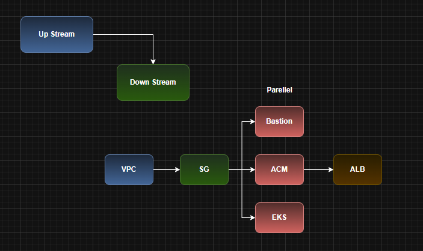
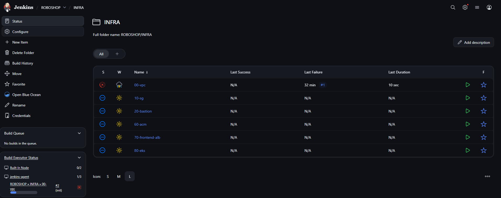
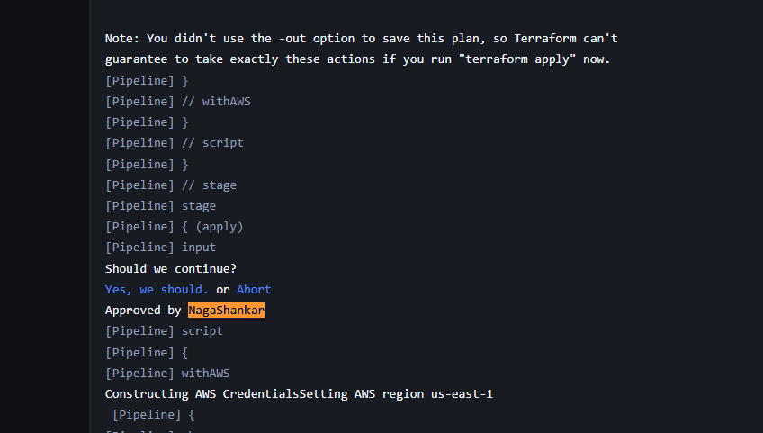
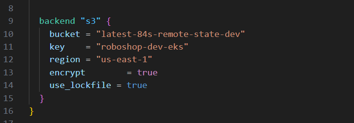

## In this repo, we create the complete INFRA using the terraform and Jenkins files for varios components

    First Install the terraform on the Jenkins agent machine

    Install yum-config-manager to manage your repositories.

        $ sudo yum install -y yum-utils

    Use yum-config-manager to add the official HashiCorp RHEL repository.

        $ sudo yum-config-manager --add-repo https://rpm.releases.hashicorp.com/RHEL/hashicorp.repo

    Install Terraform from the new repository.

        $ sudo yum -y install terraform

## Understanding Upstream and Downstream

    From the below image, we can understand that Security Group is dependent on VPC and Bastion depends on Security Group. And the ALB is dependent on ACM

    ACM, EKS and Bastion are not dependent on each other, so these pipelines can be executed parallelly

    We will be creating the below infra using this repo. In future, we have to remember that we are only creating the below mentioned infra from this repo

    From the below image, we have to understand that we need to approve the terrafom apply command as per the pipeline (input part)configuration.
    Also, if yuo notice, we are not mentioning the input part in other pipelines

    As we are not using the any s3 bucket for storing our state file, we are not using the below peace of code in our provider.tf file when compared with the Siva repo and due to this removal only, we are using the terraform init in the piepline but Siva is using terraform init -reconfigure as he is storing the statefile in an s3 bucket
